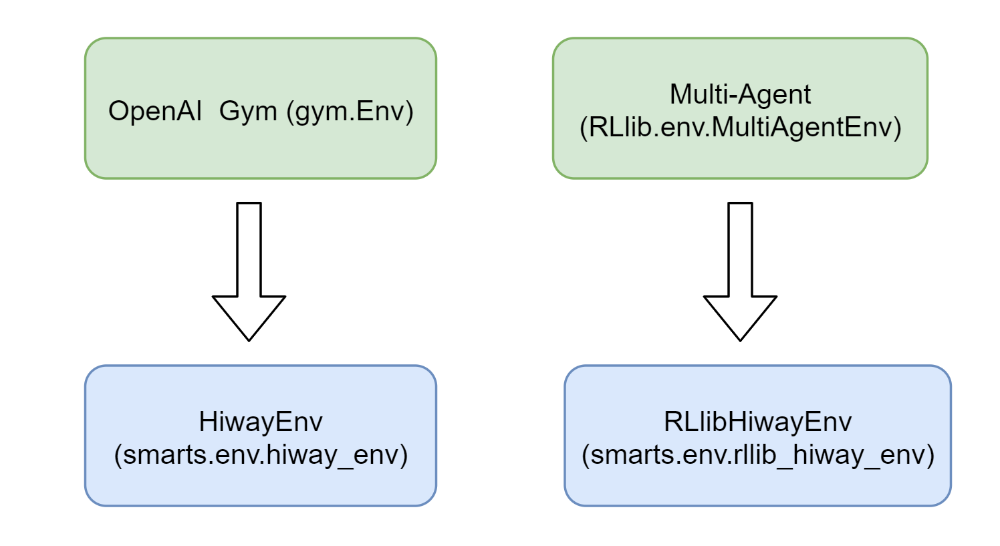

## SMARTS Environment

### Provided Environments
SMARTS Environment module is defined in `smarts/env`. Currently SMARTS provide two kinds of two kinds of training 
environments, one is `HiwayEnv` with `gym.env` style and another is `RLlibHiwayEnv` customized for `RLlib` training.



#### HiwayEnv
`HiwayEnv` inherit class `gym.Env` and supports common env APIs like `reset`, `step`, `close`. A usage example is shown below.
See `smarts/env/hiway_env.py` for more details.
```python
# make env
env = gym.make(
        "smarts.env:hiway-v0", # env entry name
        scenarios=[scenario_path], # scenarios list
        agents={AGENT_ID: agent}, # add agents
        headless=False, # enable envision gui, set False to enable.
        visdom=False, # enable visdom visualization, set False to disable. only supported in HiwayEnv.
        seed=42, # RNG Seed, seeds are set at the start of simulation, and never automatically re-seeded.
    )

# reset env
observations = env.reset()

# step env
agent_obs = observations[AGENT_ID]
agent_action = agent.act(agent_obs)
observations, rewards, dones, _ = env.step({AGENT_ID: agent_action})

# close env
env.close()

```

#### RLlibHiwayEnv
`RLlibHiwayEnv` inherit class `MultiAgentEnv` which is defined by RLlib. It also supports common env APIs like `reset`, 
`step`, `close`. A usage example is shown below. see `smarts/env/rllib_hiway_env` for more details.
```python
from smarts.env.rllib_hiway_env import RLlibHiWayEnv
env = RLlibHiWayEnv(
    config={
        "scenarios": [scenario_path], # scenarios list
        "agents": {AGENT_ID: agent}, # add agents
        "headless": False, # enable envision gui, set False to enable.
        "seed": 42, # RNG Seed, seeds are set at the start of simulation, and never automatically re-seeded.
    }
)

# reset env
observations = env.reset()

# step env
agent_obs = observations[AGENT_ID]
agent_action = agent.act(agent_obs)
observations, rewards, dones, _ = env.step({AGENT_ID: agent_action})

# close env
env.close()

```

### Environment features

#### Flexible Training
Since SMARTS environment inherit `gym.Env` and `MultiAgentEnv`, they are able to provide common APIs to support single-agent 
and multi-agent RL training. Also, benefited from ray and RLlib, SMARTS env have high scalability and can be used for multi-instances
training on multi-cores.

#### Scenario Iterator
If pass a scenario path list to `Env` config, then SMARTS will cycle these scenarios. This means the scenario setting will be changed
after called `env.reset()`. This is especially useful for training on multi-maps. 
Also if there are **n** routes file in `scenario1/traffic` dir, then during one cycle, the iteration length for this scenario will also be **n**.

See `smarts/core/scenario.py` for implementation details.

Also, Another example about training on multi-maps with support of RLlib is shown below:
```python

# train each worker with different environmental setting
tracks_dir = [scenario1, scenario2, ...]

class MultiEnv(RLlibHiWayEnv):
    def __init__(self, env_config):
        env_config["sumo_scenarios"] = [tracks_dir[(env_config.worker_index - 1)]]
        super(MultiEnv, self).__init__(config=env_config)

tune_config = {
    "env": MultiEnv,
    "env_config": {
        "seed": tune.randint(1000),
        "scenarios": tracks_dir,
        "headless": args.headless,
        "agents": agents,
    },
    ...
  }
```

These two ways are different, since that the collected samples are from different scenarios accross time in the first way
 while from different scenarios across different workers in the second way. This means at the same time, the collected samples
 in the first way are from the same scenarios while from different scenarios in the second way.


#### Vehicle Diversity
SMARTS environments allow three types of vehicles concurrently exist, which are training ego agents, social agents driven
by agent zoo (trained model) and social vehicles controlled by SUMO. 

Ego agents are controlled by our training algorithms, and are able to interact with environment directly. Social agents 
are the same with ego agents except that they are driven by trained models and act in `ray` processes, hence they can 
provide behavioral characteristics we want. Social vehicles are controlled by SUMO with the features SUMO provided, like
 routes, vehicle types. To see more details about social vehicles generation and diversity, see our [Scenario Studio](Sstudio.md).

#### Envision and Logging
See [Visiualization](Visualization.md)

#### Flexible User Customation

See [Agent](Agent.md)