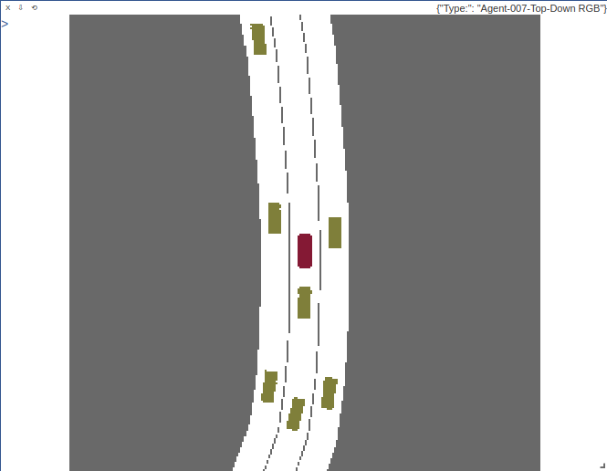

## Observation Space
We have introduced `AgentInterface` in [Agent](Agent.md) session. Here we will introduce available observation details.
For `AgentType.Full`, which contains the most concrete observation details, the raw observation returned
 is a Python `namedtuple` with the following fields,
* `events` a `namedtuple` with the following fields,
    * `collisions` - Information about how the vehicle has run into another vehicle(if at all)
    * `off_road` - `True` if the vehicle is off the road
    * `reached_goal` - `True` if the vehicle has reached its goal
    * `reached_max_episode_steps` - `True` if the vehicle has reached its max episode steps
* `ego_vehicle_state` - a `VehicleState` `namedtuple` with the following fields,
    * `heading` - vehicle heading in degrees
    * `speed` - agent speed in km/h
    * `throttle` - a normalized engine force value
    * `brake` - a normalized brake force value
    * `steering` - wheel angle (Deg)
    * `position` - 3D numpy array (x, y, z) of vehicle
    * `bounding_box` - `BoundingBox` `namedtuple` for the `width`, `length`, `height`
* `neighborhood_vehicle_states` - a list of `SocialVehicleState` `namedtuple`s, each with the following fields,
    * `heading`, `speed`, `position`, `bounding_box` - same as with the `ego_vehicle_state`
    * `lane_id` - a global unique identifier of the lane under this waypoint
    * `lane_index` - index of the lane under this waypoint, right most lane has index 0 and the index increments to the left
* `top_down_rgb` - A 256x256 RGB image following the ego vehicle
    
* `occupancy_grid_map` - A 64x64 [OGM](https://en.wikipedia.org/wiki/Occupancy_grid_mapping) map following around the ego vehicle
* `waypoint_paths` - A list of waypoints in front of the ego vehicle showing the potential routes ahead. Each item is a `Waypoint` instance with the following fields,
    * `id` - an integer identifier for this waypoint
    * `pos` - a numpy array (x, y) center point along the lane
    * `heading` - heading angle of lane at this point (degrees)
    * `lane_width` - width of lane at this point (meters)
    * `speed_limit` - lane speed in km/h
    * `lane_id` - a global unique identifier of lane under waypoint
    * `right_of_way` - `True` if this waypoint has right of way, `False` otherwise
    * `lane_index` - index of the lane under this waypoint, right most lane has index 0 and the index increments to the left

See implemention in `smarts/core/sensors.py`

Then, you can custom the observations needed through `AgentInterface` and process the raw observations through `observation_adapter`.

## Action Space

The discrete action space includes  "keep_lane",  "slow_down", "change_lane_left", "change_lane_right".

The continuous action space is a tuple of `throttle` [0, 1], `brake` [0, 1], and `steering_rate` [-1, 1].
